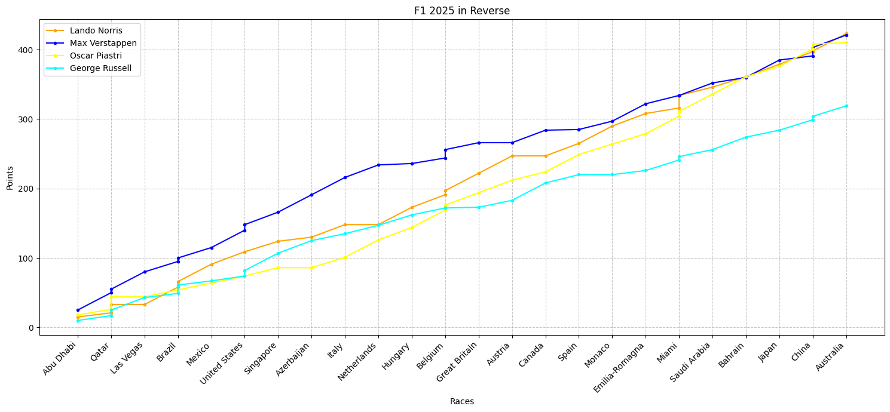

# F1 2025 Season: The Reverse Championship Analysis

## Project Overview

This project explores an alternative perspective of the Formula 1 2025 season by analyzing race and sprint results in reverse chronological order. Instead of tracking cumulative points from the start of the season, we calculate points cumulatively from the *end* of the season backwards. This approach aims to visualize how championship standings would unfold if races were weighted by their proximity to the season finale.

## Visualization

## Key Findings

After processing and visualizing the data in reverse, the analysis reveals the hypothetical championship standings after each race, starting from the season finale. The top 4 drivers are displayed for each race along with their reverse cumulative points.

*   **Max Verstappen** starts off the season with a strong lead, and it's the McLaren's playing catch up this time.
*   **Oscar Piastri** dramatically loses the title at his home grand prix in Australia after going in with a five point lead.
*   **George Russell** is seen as a serious title contender till the summer break, until he has a dramatic fall-off.
*   **Lando Norris** emerges victorious in a similar fashion to Sebastian Vettel in 2010 - he never led the championship until the final round.

## Data Sources

The analysis uses two primary datasets for the 2025 Formula 1 season:

*   `Formula1_2025Season_RaceResults.csv`: Contains detailed results for all Grand Prix races.
*   `Formula1_2025Season_SprintResults.csv`: Contains detailed results for all Sprint races.

## Data Processing and Analysis

1.  **Data Loading**: Both `RaceResults.csv` and `SprintResults.csv` are loaded into pandas DataFrames.
2.  **Driver Selection**: A subset of prominent drivers ('Lando Norris', 'Max Verstappen', 'Oscar Piastri', 'George Russell') is selected for focused analysis.
3.  **Race Order Assignment**: A unique order is assigned to each track, allowing for sorting and analysis of races in their correct chronological sequence.
4.  **Data Merging**: Race and sprint results are merged, first with the assigned race order, and then concatenated into a single `results` DataFrame.
5.  **Data Cleaning**: 'NC' (Not Classified) and 'DQ' (Disqualified) values in the 'Position' column are replaced with `np.nan`, and the 'Position' column is converted to a numeric type for consistent processing.
6.  **Reverse Sorting**: The combined `results` DataFrame is sorted in reverse chronological order (`Order` descending) and then by 'Position' (ascending) to prepare for backward cumulative point calculation.
7.  **Cumulative Points Calculation**: For each driver, cumulative points (`Points_Cum`) are calculated starting from the last race and moving backwards towards the first race of the season. This is achieved by grouping by 'Driver' and applying a `cumsum` on 'Points' to the `results_reversed` DataFrame.

## Detailed Championship Standings

--- Abu Dhabi Race Results ---
1 Max Verstappen
2 Oscar Piastri
3 Lando Norris
4 Charles Leclerc
5 George Russell
6 Fernando Alonso
7 Esteban Ocon
8 Lewis Hamilton
9 Nico Hulkenberg
10 Lance Stroll

Champion Standings after Abu Dhabi
  1. Max Verstappen: 25 points
  2. Oscar Piastri: 18 points
  3. Lando Norris: 15 points
  4. Charles Leclerc: 12 points

--- Qatar Race Results ---
1 Max Verstappen
1 Oscar Piastri
2 Oscar Piastri
2 George Russell
3 Carlos Sainz
3 Lando Norris
4 Lando Norris
4 Max Verstappen
5 Kimi Antonelli
5 Yuki Tsunoda

Champion Standings after Qatar
  1. Max Verstappen: 55 points
  2. Oscar Piastri: 44 points
  3. Lando Norris: 33 points
  4. George Russell: 25 points

--- Las Vegas Race Results ---
1 Max Verstappen
2 George Russell
3 Kimi Antonelli
4 Charles Leclerc
5 Carlos Sainz
6 Isack Hadjar
7 Nico Hulkenberg
8 Lewis Hamilton
9 Esteban Ocon
10 Oliver Bearman

Champion Standings after Las Vegas
  1. Max Verstappen: 80 points
  2. Oscar Piastri: 44 points
  3. George Russell: 43 points
  4. Lando Norris: 33 points

--- Brazil Race Results ---
1 Lando Norris
1 Lando Norris
2 Kimi Antonelli
2 Kimi Antonelli
3 Max Verstappen
3 George Russell
4 George Russell
4 Max Verstappen
5 Oscar Piastri
5 Charles Leclerc

Champion Standings after Brazil
  1. Max Verstappen: 100 points
  2. Lando Norris: 66 points
  3. George Russell: 61 points
  4. Oscar Piastri: 54 points

--- Mexico Race Results ---
1 Lando Norris
2 Charles Leclerc
3 Max Verstappen
4 Oliver Bearman
5 Oscar Piastri
6 Kimi Antonelli
7 George Russell
8 Lewis Hamilton
9 Esteban Ocon
10 Gabriel Bortoleto

Champion Standings after Mexico
  1. Max Verstappen: 115 points
  2. Lando Norris: 91 points
  3. George Russell: 67 points
  4. Oscar Piastri: 64 points

--- United States Race Results ---
1 Max Verstappen
1 Max Verstappen
2 Lando Norris
2 George Russell
3 Charles Leclerc
3 Carlos Sainz
4 Lewis Hamilton
4 Lewis Hamilton
5 Oscar Piastri
5 Charles Leclerc

Champion Standings after United States
  1. Max Verstappen: 148 points
  2. Lando Norris: 109 points
  3. George Russell: 82 points
  4. Oscar Piastri: 74 points

--- Singapore Race Results ---
1 George Russell
2 Max Verstappen
3 Lando Norris
4 Oscar Piastri
5 Kimi Antonelli
6 Charles Leclerc
7 Fernando Alonso
8 Lewis Hamilton
9 Oliver Bearman
10 Carlos Sainz

Champion Standings after Singapore
  1. Max Verstappen: 166 points
  2. Lando Norris: 124 points
  3. George Russell: 107 points
  4. Oscar Piastri: 86 points

--- Azerbaijan Race Results ---
1 Max Verstappen
2 George Russell
3 Carlos Sainz
4 Kimi Antonelli
5 Liam Lawson
6 Yuki Tsunoda
7 Lando Norris
8 Lewis Hamilton
9 Charles Leclerc
10 Isack Hadjar

Champion Standings after Azerbaijan
  1. Max Verstappen: 191 points
  2. Lando Norris: 130 points
  3. George Russell: 125 points
  4. Oscar Piastri: 86 points

--- Italy Race Results ---
1 Max Verstappen
2 Lando Norris
3 Oscar Piastri
4 Charles Leclerc
5 George Russell
6 Lewis Hamilton
7 Alexander Albon
8 Gabriel Bortoleto
9 Kimi Antonelli
10 Isack Hadjar

Champion Standings after Italy
  1. Max Verstappen: 216 points
  2. Lando Norris: 148 points
  3. George Russell: 135 points
  4. Oscar Piastri: 101 points

--- Netherlands Race Results ---
1 Oscar Piastri
2 Max Verstappen
3 Isack Hadjar
4 George Russell
5 Alexander Albon
6 Oliver Bearman
7 Lance Stroll
8 Fernando Alonso
9 Yuki Tsunoda
10 Esteban Ocon

Champion Standings after Netherlands
  1. Max Verstappen: 234 points
  2. Lando Norris: 148 points
  3. George Russell: 147 points
  4. Oscar Piastri: 126 points

--- Hungary Race Results ---
1 Lando Norris
2 Oscar Piastri
3 George Russell
4 Charles Leclerc
5 Fernando Alonso
6 Gabriel Bortoleto
7 Lance Stroll
8 Liam Lawson
9 Max Verstappen
10 Kimi Antonelli

Champion Standings after Hungary
  1. Max Verstappen: 236 points
  2. Lando Norris: 173 points
  3. George Russell: 162 points
  4. Oscar Piastri: 144 points

--- Belgium Race Results ---
1 Oscar Piastri
1 Max Verstappen
2 Lando Norris
2 Oscar Piastri
3 Charles Leclerc
3 Lando Norris
4 Max Verstappen
4 Charles Leclerc
5 George Russell
5 Esteban Ocon

Champion Standings after Belgium
  1. Max Verstappen: 256 points
  2. Lando Norris: 197 points
  3. Oscar Piastri: 176 points
  4. George Russell: 172 points

--- Great Britain Race Results ---
1 Lando Norris
2 Oscar Piastri
3 Nico Hulkenberg
4 Lewis Hamilton
5 Max Verstappen
6 Pierre Gasly
7 Lance Stroll
8 Alexander Albon
9 Fernando Alonso
10 George Russell

Champion Standings after Great Britain
  1. Max Verstappen: 266 points
  2. Lando Norris: 222 points
  3. Oscar Piastri: 194 points
  4. George Russell: 173 points

--- Austria Race Results ---
1 Lando Norris
2 Oscar Piastri
3 Charles Leclerc
4 Lewis Hamilton
5 George Russell
6 Liam Lawson
7 Fernando Alonso
8 Gabriel Bortoleto
9 Nico Hulkenberg
10 Esteban Ocon

Champion Standings after Austria
  1. Max Verstappen: 266 points
  2. Lando Norris: 247 points
  3. Oscar Piastri: 212 points
  4. George Russell: 183 points

--- Canada Race Results ---
1 George Russell
2 Max Verstappen
3 Kimi Antonelli
4 Oscar Piastri
5 Charles Leclerc
6 Lewis Hamilton
7 Fernando Alonso
8 Nico Hulkenberg
9 Esteban Ocon
10 Carlos Sainz

Champion Standings after Canada
  1. Max Verstappen: 284 points
  2. Lando Norris: 247 points
  3. Oscar Piastri: 224 points
  4. George Russell: 208 points

--- Spain Race Results ---
1 Oscar Piastri
2 Lando Norris
3 Charles Leclerc
4 George Russell
5 Nico Hulkenberg
6 Lewis Hamilton
7 Isack Hadjar
8 Pierre Gasly
9 Fernando Alonso
10 Max Verstappen

Champion Standings after Spain
  1. Max Verstappen: 285 points
  2. Lando Norris: 265 points
  3. Oscar Piastri: 249 points
  4. George Russell: 220 points

--- Monaco Race Results ---
1 Lando Norris
2 Charles Leclerc
3 Oscar Piastri
4 Max Verstappen
5 Lewis Hamilton
6 Isack Hadjar
7 Esteban Ocon
8 Liam Lawson
9 Alexander Albon
10 Carlos Sainz

Champion Standings after Monaco
  1. Max Verstappen: 297 points
  2. Lando Norris: 290 points
  3. Oscar Piastri: 264 points
  4. George Russell: 220 points

--- Emilia-Romagna Race Results ---
1 Max Verstappen
2 Lando Norris
3 Oscar Piastri
4 Lewis Hamilton
5 Alexander Albon
6 Charles Leclerc
7 George Russell
8 Carlos Sainz
9 Isack Hadjar
10 Yuki Tsunoda

Champion Standings after Emilia-Romagna
  1. Max Verstappen: 322 points
  2. Lando Norris: 308 points
  3. Oscar Piastri: 279 points
  4. George Russell: 226 points

--- Miami Race Results ---
1 Oscar Piastri
1 Lando Norris
2 Lando Norris
2 Oscar Piastri
3 George Russell
3 Lewis Hamilton
4 Max Verstappen
4 George Russell
5 Alexander Albon
5 Lance Stroll

Champion Standings after Miami
  1. Max Verstappen: 334 points
  2. Lando Norris: 334 points
  3. Oscar Piastri: 311 points
  4. George Russell: 246 points

--- Saudi Arabia Race Results ---
1 Oscar Piastri
2 Max Verstappen
3 Charles Leclerc
4 Lando Norris
5 George Russell
6 Kimi Antonelli
7 Lewis Hamilton
8 Carlos Sainz
9 Alexander Albon
10 Isack Hadjar

Champion Standings after Saudi Arabia
  1. Max Verstappen: 352 points
  2. Lando Norris: 346 points
  3. Oscar Piastri: 336 points
  4. George Russell: 256 points

--- Bahrain Race Results ---
1 Oscar Piastri
2 George Russell
3 Lando Norris
4 Charles Leclerc
5 Lewis Hamilton
6 Max Verstappen
7 Pierre Gasly
8 Esteban Ocon
9 Yuki Tsunoda
10 Oliver Bearman

Champion Standings after Bahrain
  1. Oscar Piastri: 361 points
  2. Lando Norris: 361 points
  3. Max Verstappen: 360 points
  4. George Russell: 274 points

--- Japan Race Results ---
1 Max Verstappen
2 Lando Norris
3 Oscar Piastri
4 Charles Leclerc
5 George Russell
6 Kimi Antonelli
7 Lewis Hamilton
8 Isack Hadjar
9 Alexander Albon
10 Oliver Bearman

Champion Standings after Japan
  1. Max Verstappen: 385 points
  2. Lando Norris: 379 points
  3. Oscar Piastri: 376 points
  4. George Russell: 284 points

--- China Race Results ---
1 Oscar Piastri
1 Lewis Hamilton
2 Lando Norris
2 Oscar Piastri
3 George Russell
3 Max Verstappen
4 Max Verstappen
4 George Russell
5 Esteban Ocon
5 Charles Leclerc

Champion Standings after China
  1. Oscar Piastri: 408 points
  2. Max Verstappen: 403 points
  3. Lando Norris: 398 points
  4. George Russell: 304 points

--- Australia Race Results ---
1 Lando Norris
2 Max Verstappen
3 George Russell
4 Kimi Antonelli
5 Alexander Albon
6 Lance Stroll
7 Nico Hulkenberg
8 Charles Leclerc
9 Oscar Piastri
10 Lewis Hamilton

Champion Standings after Australia
  1. Lando Norris: 423 points
  2. Max Verstappen: 421 points
  3. Oscar Piastri: 410 points
  4. George Russell: 319 points

